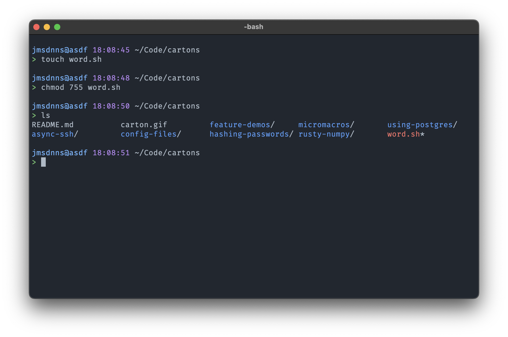
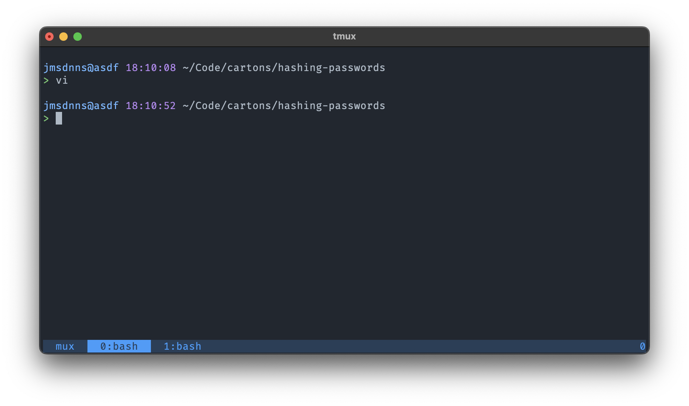
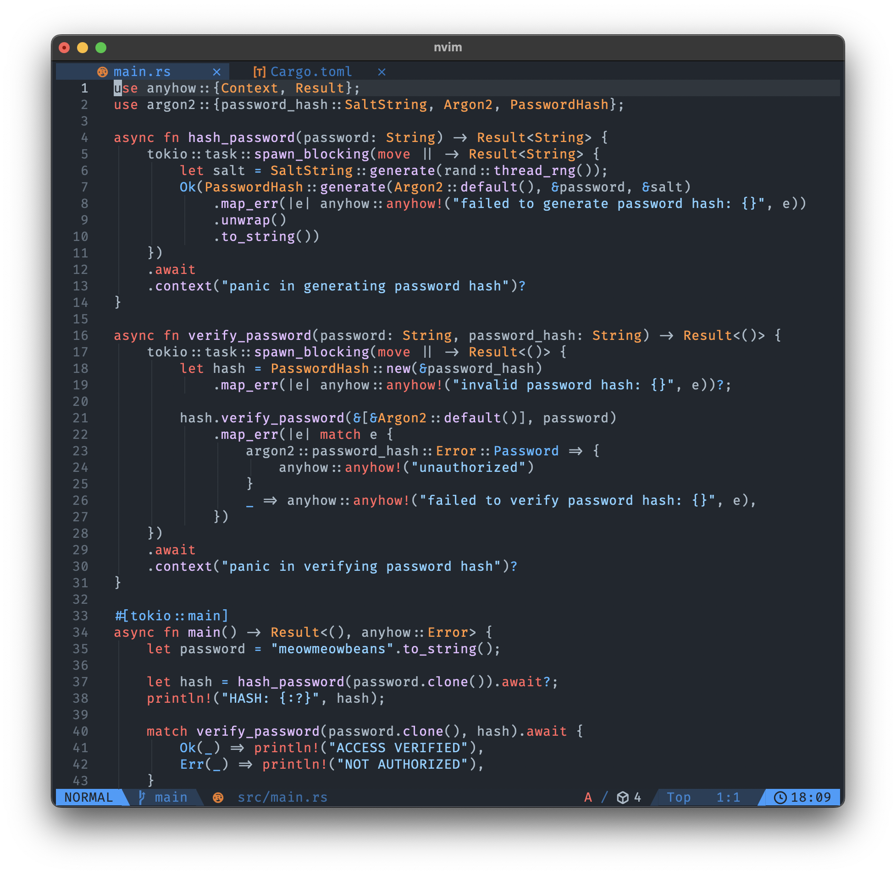
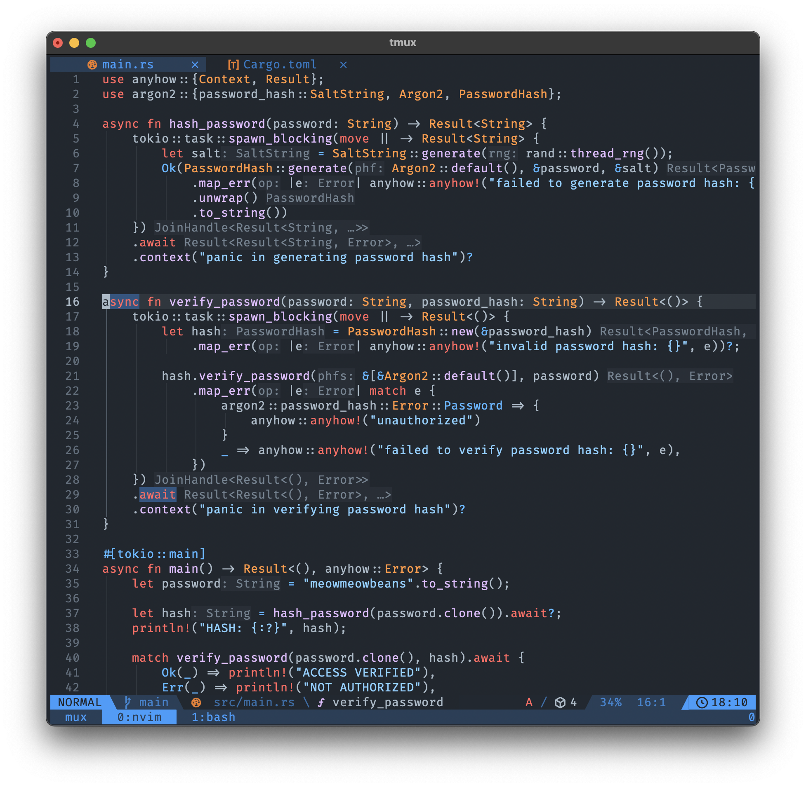

# Tachikoma

This repo contains the environments and themes I use on my machines. The themes are based on the adorable spidertanks in Ghost In The Shell, called [Tachikomas](https://ghostintheshell.fandom.com/wiki/Tachikoma).

Themes exist for Neovim, Tmux, Bash, Konsole, and iTerm2.

## Screenshots

### A simple terminal.

### A terminal with tmux running

### Neovim

### Neovim with tmux

